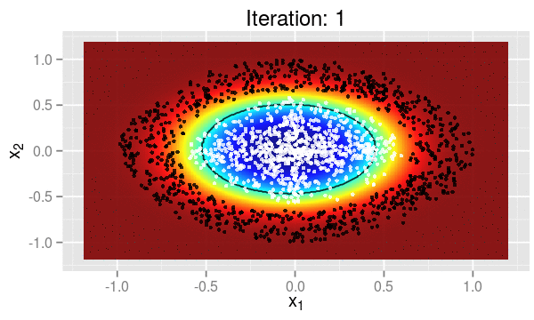

Bayesian Classification with Regularized Gaussian Models
========================================================

This work presents a novel approach to reduce the effects of the violations of the attribute independence assumption on which the Gaussian naive Bayes classifier is based. A Regularized Gaussian Bayes (RGB) algorithm is introduced, that considers the correlation structure among variables to learn the class posterior probabilities. The proposed RGB classifier avoids overfitting by replacing the sample covariance estimate with well-conditioned regularized estimates. So, RGB aims to find the best trade-off between non-naivety and prediction accuracy.

Moreover, improvements in RGB accuracy and stability are achieved using Adaptive Boosting (AdaBoost). In short, the proposed Boosted RGB (BRGB) classifier generates a sequentially weighted set of RGB base classifiers that are combined to form a robust classifier. Classification experiments have demonstrated that the BRGB achieves prediction performance comparable to the best off-the-shelf ensemble based architectures, such as Random Forests, Extremely Randomized Trees (ExtraTrees) and Gradient Boosting Machines (GBMs), using few (10 to 20) base classifiers.

### References

[1] Ledoit, Olivier, and Michael Wolf. ["A well-conditioned estimator for large-dimensional covariance matrices."](http://dx.doi.org/10.1016/S0047-259X(03)00096-4) Journal of multivariate analysis 88.2 (2004): 365-411.

[2] Chen, Yilun, et al. ["Shrinkage algorithms for MMSE covariance estimation."](http://dx.doi.org/10.1109/TSP.2010.2053029) Signal Processing, IEEE Transactions on 58.10 (2010): 5016-5029.

[3] Schäfer, Juliane, and Korbinian Strimmer. ["A shrinkage approach to large-scale covariance matrix estimation and implications for functional genomics."](http://dx.doi.org/10.2202/1544-6115.1175) Statistical applications in genetics and molecular biology 4.1 (2005).

[4] Opgen-Rhein, Rainer, and Korbinian Strimmer. ["Accurate ranking of differentially expressed genes by a distribution-free shrinkage approach."](http://dx.doi.org/10.2202/1544-6115.1252) Statistical Applications in Genetics and Molecular Biology 6.1 (2007).

[5] Tipping, Michael E., and Christopher M. Bishop. ["Probabilistic principal component analysis."](http://dx.doi.org/10.1111/1467-9868.00196) Journal of the Royal Statistical Society: Series B (Statistical Methodology) 61.3 (1999): 611-622. 

[6] Minka, Thomas P. ["Automatic choice of dimensionality for PCA."](http://research.microsoft.com/en-us/um/people/minka/papers/pca/minka-pca.pdf) NIPS. Vol. 13. 2000.

[7] Witten, Daniela M., Robert Tibshirani, and Trevor Hastie. ["A penalized matrix decomposition, with applications to sparse principal components and canonical correlation analysis."](http://dx.doi.org/10.1093/biostatistics/kxp008) Biostatistics (2009): kxp008.

[8] Friedman, Jerome, Trevor Hastie, and Robert Tibshirani. ["Sparse inverse covariance estimation with the graphical lasso."](http://dx.doi.org/10.1093/biostatistics/kxm045) Biostatistics 9.3 (2008): 432-441.

[9] Hsieh, Cho-Jui, et al. ["Sparse inverse covariance matrix estimation using quadratic approximation."](http://jmlr.org/papers/v15/hsieh14a.html) Advances in Neural Information Processing Systems. 2011.

[10] Freund, Yoav, Robert Schapire, and N. Abe. ["A short introduction to boosting."](http://cseweb.ucsd.edu/~yfreund/papers/IntroToBoosting.pdf) Journal-Japanese Society For Artificial Intelligence 14, no. 771-780 (1999): 1612.

[11] Schapire, Robert E., and Yoav Freund. ["Boosting: Foundations and algorithms."](https://mitpress.mit.edu/books/boosting) MIT press, 2012.

[12] Niculescu-Mizil, Alexandru, and Rich Caruana. ["Predicting good probabilities with supervised learning."](http://dx.doi.org/10.1145/1102351.1102430) In Proceedings of the 22nd international conference on Machine learning, pp. 625-632. ACM, 2005.

img[src*='#center']{ float: right; }
